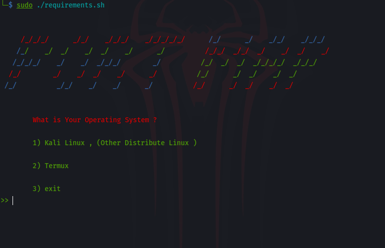
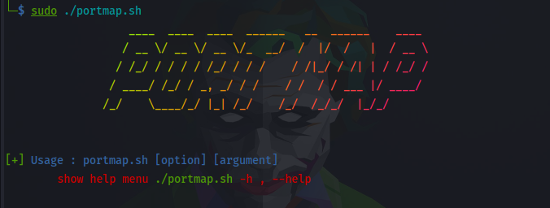
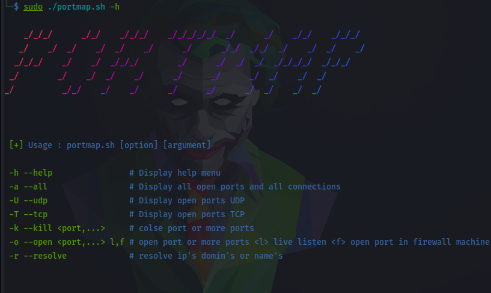
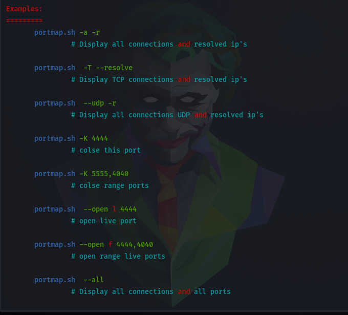

# PortMap

**portMap**: tool is a tool that scans all your ports to be aware of all the open ports on the machine you are using.


## Features
*	communication filter **(TCP , UDP )**
*	Opening a direct port or more than one port at the same time.
*	reselve destenation ip's or hosts to domain or names.
*	show all or specific Communication Clearly and comfortably.

## Defects
* The tool did not support some modern protocols such as **( UDP6 , TCP6 )** .
* Some things may not be clear if you choose the --resolve option .

## Installation
Download PortMap by cloning the Git repository:
<br />```$ git clone https://github.com/Dark-Night0/PortMap.git```
<br />```$ chmod +x requirements.sh```
<br />```$ sudo requirements.sh```
<br /><br /> 
* Choose the operating system



<br />```$ sudo ./portmap.sh```
<br />
<br />


## Usage
Display Help menu Enter command on terminal :<br />
<br />```$ sudo ./portmap.sh -h```
  <br /><br />


## Example

**scroll down**
  <br /><br />
  

## Author

* **DARK_** 
A special thank to, [DARK](https://github.com/Dark-Night0)
